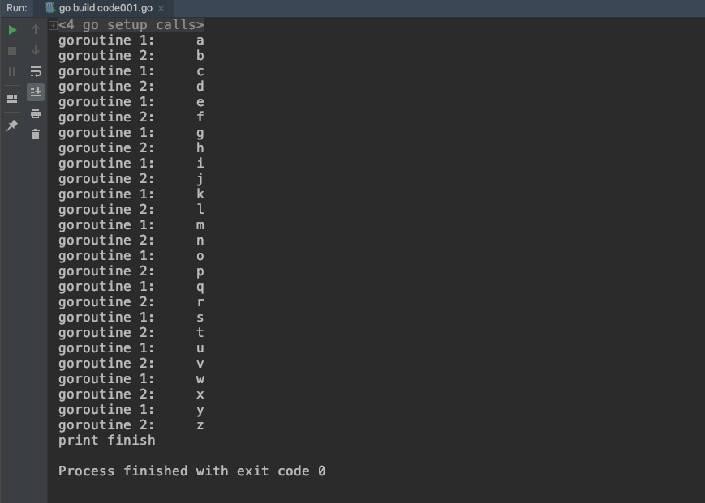

## code001. 
- 题目
```
设计两个goroutine，一个打印a,c,e...，另一个打印b,d,f...
输出结构为a,b,c,d,e...z
```
- 实现
```
package main

import (
	"fmt"
)

func main() {
	ch1Toch2 := make(chan byte, 1)
	ch2Toch1 := make(chan byte, 1)
	quit := make(chan bool)

	go func() {
		for {
			if char, ok := <-ch2Toch1; ok {
				fmt.Println("goroutine 1:\t", string(char))
				if char+1 > byte('z') {
					quit <- true
					break
				}
				ch1Toch2 <- byte(char) + 1
			}
		}
	}()

	go func() {
		for {
			if char, ok := <-ch1Toch2; ok {
				fmt.Println("goroutine 2:\t", string(char))
				if char+1 > byte('z') {
					quit <- true
					break
				}
				ch2Toch1 <- byte(char) + 1
			}
		}
	}()

	ch2Toch1 <- 'a'
	<-quit
	fmt.Println("print finish")
}

```
- 结果截图

